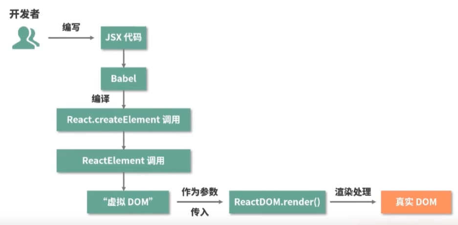

# React面试题

## 谈谈你对React的理解

React是构建用户界面的JavaScript库，只提供了UI层面的解决方案

特点： 
- JSX的语法
    
- 单向数据绑定
    速度更快
- 虚拟DOM
- 声明式编程
- component 更注重抽离和组件化
    组件式开发，提高代码复用率
    应该具有的特点：可组合，可重用，可维护

## JSX转成真实DOM的过程

JSX是JavaScript的一种语法拓展，它和模板语言很像，但是它具备充分的JavaScript的能力

经过babel的处理

1. JSX 会被编译为React.createElement(), React.createElement()将会返回一个叫做React Element的JS对象
  这里的编译就是指babel
  ```javascript
  /**
  * React.createElement
  * @param {*} type 用于标识节点的类型
  * @param {*} config 以对象形式传入，组件所有的属性都会以键值对的形式储存到conig对象中
  * @param {*} children 以对象的形式传入，，它记录的是组件标签之间的嵌套的内容
  */
  export function createElement(type, config, children) {
    ...
  }
  ```
  🔨 demo
  ```javascript
  class ClassComponent extends Component {     // 类式组件
    static defaultProps = {
      color: "pink"
    };
    render() {
      return (
        <div className="border">
          <h3>ClassComponent</h3>
          <p className={this.props.color}>{this.props.name}</p >
        </div>
      );
    }
  }

  function FunctionComponent(props) {      // 函数式组件
    return (
      <div className="border">
        FunctionComponent
        <p>{props.name}</p >
      </div>
    );
  }

  const jsx = (                        
    <div className="border">
      <p>xx</p >                   
      <a href="#">xxx</ a>
      <FunctionComponent name="函数组件" />
      <ClassComponent name="类组件" color="red" />
    </div>
  );
  ```
  这里值得注意的是

  JSX ->  babel -> React.createElement -> ReactElement -> 虚拟DOM ->ReactDoM.render() -> 真实DOM

  在转化过程中，babel在编译时会判断 JSX 中组件的首字母：

  当首字母为小写时，其被认定为原生 DOM 标签，createElement 的第一个变量被编译为字符串

  当首字母为大写时，其被认定为自定义组件，createElement 的第一个变量被编译为对象

  React.createElement其被调用时会传⼊标签类型type，标签属性props及若干子元素children

2. 最后，React.render会将React Element对象渲染到真实的DOM
  最后就是挂载某个节点上
  ReactDOM.render(<App />,  document.getElementById("root"));
  ```javascript
  ReactDOM.render(
    // 需要渲染的元素(ReactElement)
    element,
    // 元素挂载的目标容器
    container,
    // 回调函数， 可选参数，， 可以用来处理渲染结束后的逻辑
    callback
  )
  ```

整个流程图解




## React 生命周期

组件初始化 -> render方法 

渲染工作流
指的是从组件数据改变到组件实际更新发生的过程

React15

挂载 -> 更新 -> 卸载

- constructor()
- componentWillReceiveProps()
  父组件触发更新时触发（不一定是相关的props）
- componentWillUnmount
  组件卸载时触发（组件被移除 ）

React16

废弃了componentWillMount

- getDerivedStateFromProps, 替代compponentWillReceiveProps
  使用Props来派生/更新state
  在更新和挂载两个阶段都会触发
 


## 说说 Real DOM 和 Virtual DOM 的区别？优缺点？


虚拟DOM

组件更新 -> render方法 ->  生成新的虚拟DOM -> diff算法 -> 定位两次的差异 -> 渲染真实DOM

## useRef和useState的区别

- useRef
    - 获取元素
      useRef 返回一个可变的 ref 对象
    - 保存变量

- useState
  使用, 返回两个值，state，和更新函数
  ```javascript
    const [state, setState] = useState(initialValue)
  ```

## 说说对React中类组件和函数组件的理解？有什么区别？
## 类式组件

## 函数式组件
## 说说对React Hooks的理解？解决了什么问题？

解决函数组件原为无状态组件，成为内部可以进行维护自身状态

- useState
    ```javascript
      const [state, setState] = useState(initialState)
    ```
    注意：
    1. initialState: 你希望 state 初始化的值。它可以是任何类型的值，但对于函数有特殊的行为。在初始渲染后，此参数将被忽略
    2. 严格模式下，React将两次调用初始化函数，
    3. set函数仅更新下一次的渲染的状态变量。如果在调用set函数后读取状态变量。如果在调用 set 函数后读取状态变量，则 仍会得到在调用之前显示在屏幕上的旧值。如果你提供的新值与当前 state 相同（由 Object.is 比较确定），React 将 跳过重新渲染该组件及其子组件。React 会 批量处理状态更新。它会在所有 事件处理函数运行 并调用其 set 函数后更新屏幕。这可以防止在单个事件期间多次重新渲染。
    4. flushSync 允许你强制 React 在提供的回调函数内同步刷新任何更新，这将确保 DOM 立即更新
  React 会存储新状态，使用新值重新渲染组件，并更新 UI
    调用 set 函数 不会 改变已经执行的代码中当前的 state （有一种异步的感觉）
      - **解决办法**： 你可以向 set函数中传递一个 更新函数，而不是下一个状态
      
  更新状态中的对象和数组
    可以通过创建一个新对象来替换整个对象

- useRef
    引入一个不需要渲染的值
    ```javascript
    const ref = useRef(initialValue)
    ```
    initialValue：ref 对象的 current 属性的初始值。可以是任意类型的值。这个参数在首次渲染后被忽略。

    >useRef返回一个对象，ref.current为initialValue.
    >改变 ref.current 属性时，React 不会重新渲染组件。
    >React 不知道它何时会发生改变，因为 ref 是一个普通的 JavaScript 对象。

    1. 使用 useRef 声明 ref。你可以在其中保存任何值，但最常用于保存 DOM 节点。
    2. 使用用 ref 引用一个值
     - 可以在重新渲染之间 存储信息
     - 可以在重新渲染之间 存储信息
     - 
    注意：改变ref不会触发渲染，
- useEffect
- useContext
    useContext, 可以让你读取和订阅组件中的context
    ```javascript
      useContext(SomeContext)
    ```
    SomeContext：先前用 createContext 创建的 context。context 本身不包含信息，它只代表你可以提供或从组件中读取的信息类型。
    **用法：**
     - 向组件深处传递数据
     - 通过context更新传递的数据
    
- useCallback
    
    
- useReducer
  在组件的顶层作用域调用 useReducer 以创建一个用于管理状态的 reducer。

## state 和 props 有什么区别？
- state
    state是用来保存组件状态、控制以及修改自己状态。
    外部不可访问，可以说是组件私有属性
- props
    是传递给组件的（类似于函数的传参），只读不可改
## 组件中如何验证Props
React为我们提供了PropTypes以供验证使用。如果使用typescript那么就可以直接用接口来定义。
```javascript
import React from "react";
import propTypes from 'prop-types'
class State extends React.Component {
    constructor(props){
        super(props)
        this.state = {
            
        }
    }
    render() {
        return (
            <div>
                {this.props.name}
            </div>
        )
    }
}
State.propTypes = {
    name: propTypes.string
}
export default State;
```
# super() 和 super(props) 有什么区别？
super()和super(props)都是调用父类构造函数的语句。
- super()
    会调用父类的构造函数并将this绑定到子类的实例。如果子类的构造函数中
    没有使用this,则可以省略super调用
- super(props)
    则是在子类的构造函数中调用父类的构造函数，并将props对象出传递给父类的构造函数。
    props对象传递给父类的构造函数，以便在组件中使用this.props访问它。
## super
在JavaScript中，super是一个关键字，用于调用父类中的构造函数和方法。
- 当子类继承父类时，子类必须使用 super 调用父类的构造函数，以便子类可以继承父类的属性和方法。在 constructor 方法中，使用 super 调用父类的构造函数时，可以使用 this 关键字访问子类的属性和方法
# 说说 React中的setState执行机制
类式组件中有setState机制
- 组件中多次调用setState()，会进行合并，组件只执行一次更新操作
- 流程
    1.将setState传入的partialState参数存储在当前组件实例的state暂存队列中。
    2.判断当前React是否处于批量更新状态，如果是，将当前组件加入待更新的组件队列中。
    3.如果未处于批量更新状态，将批量更新状态标识设置为true，用事务再次调用前一步方法，保证当前组件加入到了待更新组件队列中。
    4.调用事务的waper方法，遍历待更新组件队列依次执行更新。
    5.执行生命周期componentWillReceiveProps。
    6.将组件的state暂存队列中的state进行合并，获得最终要更新的state对象，并将队列置为空。
    7.执行生命周期componentShouldUpdate，根据返回值判断是否要继续更新。
    8.执行生命周期componentWillUpdate。
    9.执行真正的更新，render。
    10.执行生命周期componentDidUpdate
## setState是同步还是异步？
我们先来了解一下setState过程
代码中调用了setState函数之后，React会将传入的参数对象与组件进行合并。然后触发调和过程。经过调和过程，
React会以相对高效的方式根据新的状态构建React元素树，并且着手重新渲染整个UI界面。
- setState是同步还是异步
    setState并不是单纯异步还是同步，具体情况具体分析
    - state完全替换
    - React控制不到的地方，比如原生事件
## setState一定会合并吗
其实不然，完全替换的时候，就不会合并。合并只是一种优化策略。
## [React 高阶组件](./高阶组件.md)


## React Hooks的使用限制有哪些？


## React fiber是什么？有什么用？

Fiber会将一个额大的更新任务拆解为许多个小任务

Fiber架构的重要特征就是可以被打断的异步渲染方式

生命周期工作流

**render阶段在执行过程中允许被打断，而commit阶段总是同步执行的**


## React18和之前版本的区别


## 为什么说React中的props是只读的？

React中props是单项数据流，父组件传进子组件的数据props改变后，子组件也会进行改变，但是子组件不可更改props的值，让变化变得难以预测

## React Fiber它的目的是解决什么问题？

GUI线程和JS线程是互斥的，会导致
- GUI负责绘制
- JS执行脚本


## React组件化


## Redux

Redux是负责状态管理

- 单一数据源
- state 是只读的
- 使用纯函数来执行修改

### 如何使用

- 创建一个store

```javascript
  import { createStore } from 'redux' // 引入一个第三方的方法
  const store = createStore() // 创建数据的公共存储区域（管理员）
```

- state
    ```javascript
      // 设置默认值
      const initialState = {
        counter: 0
      }

      const reducer = (state = initialState, action) => {  // 也就是reducer
      }
    ```
- action
    改变内部状态的唯一方法是 dispatch 一个 action。
    这些 action 可以被序列化、记录或存储，然后再重放。
    用户派发action, dispatch给store
      - type 代表需要被执行的 action 类别

    ```javascript
      store.dispatch({
        type: "ADD_NUMBER",
        number: 5
      })
    ```
    **异步action**

- reducer
    接受state, action, 处理相关数据，返回state
    reducer是一个纯函数，不需要直接修改state
    ```javascript
      function counterReducer(state = { value: 0 }, action) {
        switch (action.type) {
          case "counter/incremented":
            return { value: state.value + 1 };
          case "counter/decremented":
            return { value: state.value - 1 };
          default:
            return state;
        }
      }
    ```
- 监听state的变化
  ```javascript
  store.subscribe(() => {
    console.log(store.getState());
  })
  ```
Redux Toolkit是推荐的编写Redux逻辑的方法

- 配置redux store
- 创建reducer函数并使用不可更改更新逻辑
- 一次性创建状态的某个片段slice


## React 路由

## React性能优化

