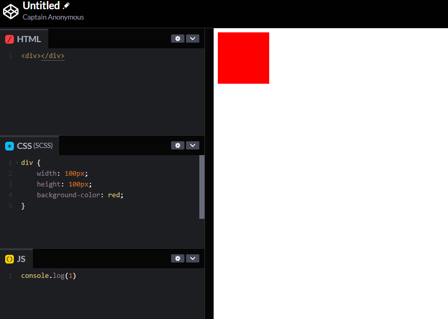

# 升级喽

## 新增功能，代码一键运行

::: normal-demo demo

```html
<div></div>
```

```js
console.log(1)
```

```scss
div {
    width: 100px;
    height: 100px;
    background-color: red;
}
```

:::

运行




## 🐥 面试题

🌊[面试题](/interview/index.md)

## 🚀 知识库

### 基础拓展

🌊[HTML](./repository/HTML/route.md)

🌊[Css](./repository/Css/routed.md)

🌊[Server 服务端](./repository/server/route.md)

### React

🌊[React 知识库](./repository/React/index.md)

🌊[Gastby 知识库](./repository/Gastby/route.md)

### AntDesign 源码解析

🌊[AntDesign 源码](/repository/AnTd-源码解析/index.md)

### Gatsby

[Gatsby](./repository/Gastby/route.md)

# Contentful

🌊[Contentful 目录](/repository/Contentful/index.md)

### 微信小程序（原生）

🌊[微信小程序](./repository/微信小程序（原生）/route.md)

🌊[微信小程序](./repository/微信小程序（原生）/route.md)

### Webpack(持续更新中)

🌊[Webpack 学习目录](/repository/Webpack/index.md)


## 前端进阶

### [你真的了解模块化吗？](./repository/模块化/route.md)

## Web 3D

### [开启Three.js之旅(会持续完善)-已发](./repository/Web3D/three.md)