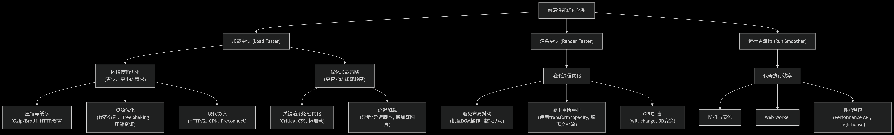

# 常见面试题

## 说说 JavaScript 中的内存泄漏有哪些？

### 什么是内存泄漏

内存泄漏是指由于某些原因，导致程序无法释放内存，从而导致内存无法被回收，从而导致内存泄漏占用不断增长，最终可能引起页面卡顿、崩溃等问题。

- 常见的 JavaScript 内存泄漏

### 1.意外的全局变量

    - 描述：最常见也是最容易犯的错误之一,在非严格模式下,创建了全局变量，但未在函数中定义，导致变量无法被垃圾回收机制回收。

    ```javascript
    function foo() {
      bar = "这是一个意外的全局变量"; // 没有用 var, let, const 声明
      this.anotherGlobal = "另一个全局变量"; // 在函数内部，this 默认指向 window
    }
    foo();
    ```

    - 解决方法：

    1. 在函数内部，使用 var, let, const 声明变量。
    2. 始终使用 'use strict'; 开启严格模式。

### 2.被遗忘的定时器或回调函数

    - 描述：setInterval, setTimeout 如果不再需要但却没有被清除，其内部引用的变量或函数也无法被回收。

    ```javascript
    // 定时器泄漏
    let someData = getHugeData();
    setInterval(() => {
      const node = document.getElementById("Node");
      if (node) {
        node.innerHTML = JSON.stringify(someData);
      }
    }, 1000); // 即使节点从 DOM 中移除了，定时器仍在执行，someData 也无法被回收

    // 被遗忘的回调（例如未移除的事件监听器）

    function setup() {
      const element = document.getElementById("button");
      element.addEventListener("click", onClick); // 添加了监听器
      // 但如果后续 element 被移除，而没有移除这个监听器，监听器函数和其闭包作用域都不会被释放
    }

    // 应该提供一个清理函数

    function teardown() {
      const element = document.getElementById("button");
      element.removeEventListener("click", onClick); // 必须移除！
    }
    ```

    - 解决方法：

    1. 使用 clearInterval 或 clearTimeout 及时清理不再需要的定时器。
    2. 对于事件监听器，在对象被销毁时（例如在组件的 unmount 生命周期或 useEffect 的清理函数中）使用 removeEventListener 主动移除。

### 3.脱离 DOM 的引用

    - 描述：当你将 DOM 元素保存在 JavaScript 中（例如在一个数组或对象中），即使你已经从页面上移除了这个 DOM 元素，由于它仍然被 JavaScript 引用着，它也不会被垃圾回收。

    ```js
    // 在 JS 中缓存一个 DOM 元素

    const elements = {
      button: document.getElementById("my-button"),
    };

    // 后来从 DOM 树中移除了这个按钮
    document.body.removeChild(document.getElementById("my-button"));

    // 此时，按钮元素本身已经从 DOM 移除了
    // 但因为它还被 elements.button 引用着，所以它占用的内存不会被释放。
    ```

    - 解决方法：

    1. 确保在移除 DOM 元素后，也清除对它的所有 JavaScript 引用（例如将 elements.button 设置为 null）。

### 4.闭包的不当使用

    - 描述：闭包是 JavaScript 的强大功能，它会保留对其外部词法环境的引用。因为闭包引用了外部作用域中的变量，这些变量可能会阻止外部作用域中的对象被垃圾回收,如果闭包持有大量数据的引用，即使外部函数已经执行完毕，这些数据也不会被释放

    ```javascript
    function outer() {
      const bigData = new Array(1000000).fill("*"); // 一个大数组

      return function inner() {
        // 内部函数（闭包）被返回
        // 即使 inner 没有显式使用 bigData，它仍然持有对 outer 环境的引用
        console.log("闭包被调用了");
        // 如果这里使用了 bigData，问题会更明显
      };
    }

    const closureFn = outer(); // outer 执行完毕，但 bigData 不会被释放，因为 closureFn 这个闭包还存在着
    ```

    - 解决方法：

    1. 注意闭包的生命周期。如果闭包不需要了，将其引用置为 null (closureFn = null)。
    2. 谨慎地在闭包中持有大型数据的引用，如果不需要这些数据，确保在适当的时候解除引用。

### 5.未清理的 Map 和 Set 等集合

    - 描述：Map 和 Set 等集合对其中的键和值是强引用。如果你将一个对象作为键存入 Map，即使这个对象在其他地方已经没有任何引用了，只要它还在 Map 中，它就不会被回收。Set 同理

    ```js
    let obj = { id: 1 };
    const map = new Map();
    map.set(obj, "some value");

    // 即使清除了外部对 obj 的引用
    obj = null;

    // 对象 { id: 1 } 仍然存在于 map 中，不会被 GC
    console.log(map.keys()); // 仍然可以访问到它
    ```

    - 解决方法：使用 WeakMap 和 WeakSet。它们是弱引用集合，其键必须是对象，且不会阻止垃圾回收机制回收这些对象。当键对象在其他地方没有被引用时，它会被自动从 WeakMap/WeakSet 中移除。

    ```js
    let obj = { id: 1 };
    const weakMap = new WeakMap();
    weakMap.set(obj, "some value");

    obj = null; // 此时，对象 { id: 1 } 可以被 GC，它也会从 weakMap 中自动消失
    ```

### 如何检查

    - 养成良好的编码习惯，在代码中进行审查，并善用开发者工具进行性能剖析，是避免和解决内存泄漏的关键。

    - 浏览器开发者工具 (Chrome DevTools)

      - Performance 面板：录制一段时间内的性能，观察 JS Heap 内存线是否持续上升而不下降。
      - Memory 面板：查看内存使用情况，观察内存使用情况是否持续上升而不下降。

    - 尤其是在使用 SPA (单页面应用) 框架（如 React, Vue, Angular）时，注意在组件的生命周期钩子中正确地添加和移除事件监听器、定时器以及取消异步请求。

## 如何性能优化

- 前端性能优化是一个系统性的工程，涵盖从资源加载、渲染、执行到网络请求等方方面面



### 一、加载性能优化 (Load Faster)

目标是让用户尽快看到和用到页面内容，主要针对资源加载。

1. 网络传输层面

   - 减少 HTTP 请求次数：

     - 使用雪碧图 (CSS Sprites) 合并小图标。
     - 使用字体图标 (Icon Font) 或 SVG 替代图片。
     - 合并 CSS 和 JS 文件（在 HTTP/2 下可能不再需要，见下文）。

   - 减少资源体积：

     - 代码压缩：使用工具（如 Terser、UglifyJS for JS；CSSNano for CSS）压缩代码，去除注释、空格、缩短变量名。
     - 启用压缩：服务器开启 Gzip 或更高效的 Brotli 压缩。
     - 图像优化：

       - 选择合适的格式：WebP（现代浏览器，效果最好）、AVIF（更前沿）通常比 JPEG/PNG 体积更小。兼容性要求高时，使用 JPEG（照片）、PNG（透明/图标）、SVG（图标/矢量图）。
       - 使用工具（如 Imagemin、Squoosh）压缩图片，保证质量的同时减小体积。
       - 使用响应式图片：srcset 和 sizes 属性为不同屏幕尺寸提供不同大小的图片。

   - 利用缓存：

     - 强缓存 (Cache-Control, Expires)：让浏览器直接从本地磁盘读取资源，完全不发请求。
     - 协商缓存 (ETag, Last-Modified)：浏览器询问服务器资源是否过期，未过期则返回 304 状态码，使用本地缓存。

   - 使用 CDN (Content Delivery Network)：将静态资源分发到全球各地的服务器，用户从最近的节点获取资源，降低网络延迟。

2. 资源加载策略

- 静态资源：

  - CSS 放在 head 标签 中：尽早加载 CSS，以免页面渲染时发生重排（FOUC）。
  - JS 放在 body 标签 底部或使用 async/defer：

    - async：异步加载，加载完立即执行，不保证顺序。
    - defer：异步加载，在文档解析完成后、DOMContentLoaded 事件触发前按顺序执行。
    - 优先使用 defer，特别是对于不依赖其他脚本的代码。

  - 代码分割 (Code Splitting) & 懒加载 (Lazy Loading)：

    - 打包工具（Webpack, Vite, Rollup）：将代码拆分成多个小块（chunk），按需加载。
    - 路由懒加载：在单页面应用（SPA）中，只加载当前路由所需的代码。
    - 图片/视频懒加载：使用 loading="lazy" 属性（原生支持）或 Intersection Observer API 实现，当元素进入视口时才加载。

  - 预加载关键资源：

    - <link rel="preload" />：高优先级下载当前导航必定用到的资源（如关键CSS、Web字体、首屏图片）。
    - <link rel="preconnect"> / <link rel="dns-prefetch">：提前与第三方源建立连接或进行DNS解析。

  - 使用 HTTP/2：

    - 多路复用 (Multiplexing)：一个 TCP 连接可以承载多个请求和响应，解决了 HTTP/1.1 的队头阻塞问题
    - 服务器推送 (Server Push)：服务器可以主动将资源推送给浏览器。
    - _注意：在 HTTP/2 下，合并文件（雪碧图、JS/CSS 合并）可能不再是最佳实践，因为多个小文件的代价变小了。_

### 二、渲染性能优化 (Render Faster)

目标是让页面解析和绘制更快，交互更流畅。

1. CSS 优化

   - 避免 CSS 选择器过于复杂：浏览器从右向左解析 CSS 选择器，过于嵌套的选择器会增加匹配成本。
   - 减少重排 (Reflow) 和重绘 (Repaint)：

     - 重排：改变元素的几何属性（宽、高、位置），导致浏览器重新计算布局。代价最大。
     - 重绘：改变元素的外观而不影响布局（颜色、背景等）。
     - 技巧：

       - 使用 transform 和 opacity 来做动画（它们只触发合成，不触发重排或重绘）。
       - 避免频繁读写布局属性（如 offsetTop, scrollTop），会强制刷新队列。最好先读后写，或使用 FastDOM 理念。
       - 使用 flexbox 布局，它在性能上通常优于传统布局。

   - 优化关键渲染路径 (Critical Rendering Path)：

     - 内联关键 CSS (Critical CSS)：将首屏内容所需的核心 CSS 直接内嵌在 HTML 的 style 标签中，避免为了一点点 CSS 而发起请求，减少首次渲染时间。

   - 避免使用 @import：它会阻塞并行加载，应使用 <link /> 标签。

2. JavaScript 执行优化

   - 避免「长任务」(Long Tasks)：长时间占用主线程的任务会阻塞 UI 渲染，导致卡顿。将大任务拆分为多个异步小任务，使用 setTimeout 或 setImmediate 分片执行。
   - 使用 Web Workers：将复杂的计算任务放到 Worker 线程中执行，不阻塞主线程。
   - 使用事件委托：在父元素上监听事件，利用事件冒泡机制处理子元素的事件，减少内存消耗和事件绑定数量。
   - 防抖 (Debounce) 和节流 (Throttle)：控制高频事件（如 scroll, resize, input）的处理频率，减少不必要的函数执行。

3. 浏览器渲染流程优化

   - 减少重绘和重排：（同上，非常重要）。
   - 硬件加速：对动画元素使用 will-change: transform; 或 transform: translateZ(0);，将其提升到独立的合成层，由 GPU 渲染，更加高效。

### 三、综合与应用级优化

- 使用性能分析工具：

  - Chrome DevTools：Performance 面板分析运行时性能，Lighthouse 进行自动化审计，Network 和 Coverage 面板分析加载情况。
  - WebPageTest：进行多地点、多环境的深度性能测试。

- 服务端渲染 (SSR)：对于 SPA，首屏需要等待 JS 下载执行完毕才能渲染内容，SSR 在服务器端生成 HTML 直接返回，可以大幅提升首屏加载速度和 SEO。

- 静态站点生成 (SSG)：如果内容不常变化，直接在构建时生成静态 HTML，性能极佳。

- 渐进式 Web 应用 (PWA)：通过 Service Worker 缓存资源和离线能力，提供类似 App 的体验和极快的二次访问速度。

### 总结：优先级的建议

1. 测量优先：使用工具找出你网站的具体性能瓶颈，不要盲目优化。
2. 关注核心 Web 指标 (Core Web Vitals)：

   - LCP (Largest Contentful Paint)：最大内容绘制，衡量加载速度。优化图片、Web 字体、服务器响应时间。
   - FID (First Input Delay) / INP (Interaction to Next Paint)：首次输入延迟/下次绘制交互，衡量交互性。优化 JavaScript 执行，分解长任务。
   - CLS (Cumulative Layout Shift)：累计布局偏移，衡量视觉稳定性。给图片和视频设置明确的 width 和 height，避免动态插入内容。

3. 从最容易赢的地方开始：如图片优化、启用压缩、利用缓存、代码分割，这些通常能带来显著的收益。

性能优化是一个持续的过程，需要不断地测量、分析、实施和监控。
