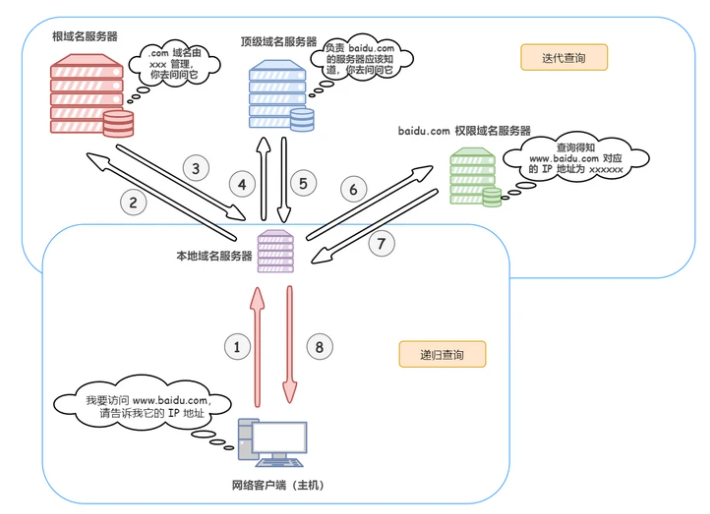

## http和https
HTTP是传文本传输协议，是实现网络通信的一种规范。
HTTP常用于在Web浏览器和网站服务器之间传递信息，以明文方式发送内容，不提供任何方式的数据加密。
特点如下：
- 支持客户端/服务器模式
- 简单快速
    客户端向服务器请求服务时，只需传送请求方法和路径。由于http协议简单，使得HTTP服务器的程序规模小，因而通信速度很快。
- 灵活
    HTTP允许传输任意类型的数据对象。正在传输的又Content-Type标记。
- 无连接
    每次连接只处理一次请求。服务器处理完客户请求，并收到客户的应答后，即断开连接。采用这种方式可以节约传输时间。
- 无状态
    每个请求都是独立的，服务器不会记录之前的请求，所以对于每次请求都会返回相同的结果。
HTTPS
HTTP是以明文的方式进行传送，这样是并不安全的。而HTTPS出现正是为了解决HTTP不安全的特性。
多的这一层是SSL/TCL协议，通过SSL证书来验证服务器的身份，并为浏览器和服务器之间的通信进行加密。
SSL协议位于TCP/IP

## https的加密流程
HTTPS（HTTP Secure）是在HTTP协议基础上添加了安全性功能的协议，使用加密来保护数据的传输。以下是HTTPS的加密流程：
- 客户端发起连接请求：客户端（例如浏览器）向服务器发送一个连接请求，指示其希望建立一个安全的HTTPS连接。
- 服务器发送证书：服务器收到客户端的请求后，会将自己的数字证书发送给客户端。数字证书包含了服务器的公钥、证书有效期、证书颁发机构等信息。
- 客户端验证证书：客户端接收到服务器的证书后，会验证证书的有效性。这包括检查证书的签名是否有效、证书是否过期、证书颁发机构是否受信任等。
- 客户端生成随机密钥：如果证书验证成功，客户端会生成一个随机的对称密钥（即会话密钥），用于后续的对称加密。
- 使用服务器的公钥加密会话密钥：客户端使用服务器的公钥对生成的会话密钥进行加密，并将加密后的会话密钥发送给服务器。
- 服务器使用私钥解密会话密钥：服务器收到客户端发送的加密会话密钥后，使用自己的私钥进行解密，得到会话密钥。
- 加密通信：客户端和服务器现在都拥有相同的会话密钥。双方使用该会话密钥进行对称加密，加密和解密传输的数据。
通过这个过程，HTTPS实现了安全的通信。客户端和服务器之间的数据传输是经过加密的，确保了数据的机密性和完整性，同时防止了中间人攻击和窃听。
## 如何理解OSI七层模型?
每一层实现各自的功能和协议，并完成与相邻的接口通信。
- 应用层
    DNS,HTTP，HTTPS
- 表示层
    
- 会话层
- 传输层
    传输层的主要任务是为了两台主进程之间的通信提供服务，处理数据包错误、数据包次序，以及其它一些关键传输的问题。
    TCP和UDP
- 网络层
- 数据链路层
- 物理层
## 三次握手和四次挥手


TCP（传输控制协议）是一种面向连接的、可靠的传输层协议。在建立连接和断开连接时，TCP 使用**三次握手**和**四次挥手**的机制来确保数据的可靠传输。以下是它们的简要说明：

---

### **TCP 三次握手（建立连接）**
三次握手用于在客户端和服务器之间建立 TCP 连接。目的是确保双方都能发送和接收数据。

1. **第一次握手（SYN）**：
   - 客户端向服务器发送一个 `SYN`（同步）报文，其中包含一个随机生成的初始序列号（`seq = x`）。
   - 客户端进入 `SYN_SENT` 状态。

2. **第二次握手（SYN + ACK）**：
   - 服务器收到 `SYN` 报文后，向客户端发送一个 `SYN + ACK`（同步 + 确认）报文。
     - `ACK` 报文的确认号为 `x + 1`（表示期望收到客户端的下一个序列号）。
     - 服务器也会生成一个随机序列号 `seq = y`。
   - 服务器进入 `SYN_RECEIVED` 状态。

3. **第三次握手（ACK）**：
   - 客户端收到 `SYN + ACK` 报文后，向服务器发送一个 `ACK`（确认）报文，确认号为 `y + 1`。
   - 客户端和服务器都进入 `ESTABLISHED` 状态，连接建立成功。

**总结**：
- 三次握手的目的是确保双方都能发送和接收数据。
- 通过交换初始序列号，双方可以确保数据的有序性和完整性。

---

### **TCP 四次挥手（断开连接）**
四次挥手用于在客户端和服务器之间断开 TCP 连接。目的是确保双方都能安全地关闭连接。

1. **第一次挥手（FIN）**：
   - 客户端向服务器发送一个 `FIN`（结束）报文，表示客户端没有数据要发送了。
   - 客户端进入 `FIN_WAIT_1` 状态。

2. **第二次挥手（ACK）**：
   - 服务器收到 `FIN` 报文后，向客户端发送一个 `ACK` 报文，确认收到 `FIN`。
   - 服务器进入 `CLOSE_WAIT` 状态，客户端进入 `FIN_WAIT_2` 状态。
   - 此时，服务器可能还有未发送完的数据。

3. **第三次挥手（FIN）**：
   - 当服务器完成数据发送后，向客户端发送一个 `FIN` 报文，表示服务器也没有数据要发送了。
   - 服务器进入 `LAST_ACK` 状态。

4. **第四次挥手（ACK）**：
   - 客户端收到 `FIN` 报文后，向服务器发送一个 `ACK` 报文，确认收到 `FIN`。
   - 客户端进入 `TIME_WAIT` 状态，等待一段时间（2MSL，Maximum Segment Lifetime）以确保服务器收到 `ACK`。
   - 服务器收到 `ACK` 后，关闭连接，进入 `CLOSED` 状态。
   - 客户端在 `TIME_WAIT` 结束后，也关闭连接，进入 `CLOSED` 状态。

**总结**：
- 四次挥手的目的是确保双方都能安全地关闭连接。
- 通过 `FIN` 和 `ACK` 的交换，确保双方都完成了数据的发送和接收。

---

### **为什么需要三次握手和四次挥手？**
1. **三次握手**：
   - 确保双方都能发送和接收数据。
   - 防止已失效的连接请求报文突然传送到服务器，导致错误。

2. **四次挥手**：
   - 确保双方都能安全地关闭连接。
   - 服务器可能需要时间处理未发送完的数据，因此需要分两次发送 `ACK` 和 `FIN`。

---

### **示意图**
#### 三次握手：
```
客户端 -> SYN -> 服务器
客户端 <- SYN + ACK <- 服务器
客户端 -> ACK -> 服务器
```

#### 四次挥手：
```
客户端 -> FIN -> 服务器
客户端 <- ACK <- 服务器
客户端 <- FIN <- 服务器
客户端 -> ACK -> 服务器
```

---

希望这个回答对你有帮助！如果还有其他问题，欢迎继续提问！

## TCP协议和UDP协议的区别
- 他们都位于osi七层模型的传输层
- 主要区别
1. 可靠性：tcp是一种可靠的协议，它提供了数据之间的可靠传输和错误检验机制。它可以确认、重传和流控制等机制来确保数据的完整性和数序性。udp是一种不可靠的协议，它不提供数据的可靠性传输保证，每个数据报都是独立的实体，可能丢失、重复或者乱序。
2. 连接性：tcp是一种面向连接的协议，他在通信之前需要通过三次握手来确保通信双方之间的连接建立。udp是一种面向无连接的协议，它不需要建立连接，发送方可以直接将数据报发送到目标地址
3. 传输效率：因为tcp提供了可靠性和复杂的控制机制，所以它的传输效率相对较低。而udp是一种轻量级的协议，没复杂的控制机制，所以传输效率相对较快
4. tcp是面向字节流的，将应用层的报文看成一串串的无结构的字节流，分解到多个tcp报文中传输后，在目标站重新装配。udp协议面向报文，不拆分报文，只保留边界，一个个发送报文，接收方去除报文首部后，原封不动的把报文交给上层。
5. tcp应用于对数据完整性和可靠性要求高的应用场景，如网页浏览，文件传输，电子邮件等。udp适用于实时性要求高的、对数据可靠性要求较低的场景，如音视频播放、实时游戏、流媒体等。
## 说说对WebSocket的理解？应用场景？
WebSocket是一种网络传输协议。
可在单个TCP连接上进行全双工通信，能更好的节省服务器资源和带宽并达到实时通讯。
客户端和服务器之间只需要一次握手，两者之间就可以创建持久性的连接，数据双向传输
- 全双工
    允许数据在两个方向上同时传输，它在能力上相当于两个单工通信方式的结合。
- 二进制帧
    
- 协议名
    ws和wss分别代表明文和密文的websocket协议，默认端口使用80或443
- 握手
- 优点
  - 更强的实时性：相对于HTTP请求需要等待客户端发起请求服务端才能响应，延迟明显更少
## 应用场景
一些需要实时更新的场景

## 说说地址栏输入 URL 敲下回车后发生了什么?
- URL解析：首先判断你输入的是一个合法的URL 还是一个待搜索的关键词，并且根据你输入的内容进行对应操作
- DNS 查询：见下文
- TCP 连接：基于url解析出来的协议来和服务器建立连接
- HTTP 请求：一旦与服务器建立连接，浏览器会发送一个HTTP请求，其中包含请求的方法（GET、POST等）、目标URL、请求头部和请求体等信息
- 处理请求：服务器接收到浏览器发送的HTTP请求后，会根据请求中的信息进行处理。它会解析URL、读取请求头部和请求体，并执行相应的逻辑来生成响应
- 响应请求：服务器根据请求的处理结果生成一个HTTP响应，包括响应状态码、响应头部和响应体等信息。响应的内容可能是HTML页面、图像、文本文件或其他数据
- 接受请求：浏览器接收到服务器发送的HTTP响应后，会读取响应头部和响应体等信息
- 页面渲染：如果响应是一个HTML页面，浏览器会解析HTML代码，并根据其中的CSS和JavaScript等资源进行页面的渲染和布局

## DNS解析过程
什么是dns：域名系统，是互联网一项服务，是进行域名和与之相对应的 IP 地址进行转换的服务器。简单来讲，DNS相当于一个翻译官，负责将域名翻译成ip地址
IP 地址：一长串能够唯一地标记网络上的计算机的数字
域名：是由一串用点分隔的名字组成的 Internet 上某一台计算机或计算机组的名称，用于在数据传输时对网站的定位标识
解析域名的过程如下：
- 首先搜索浏览器的 DNS 缓存，缓存中维护一张域名与 IP 地址的对应表
- 若没有命中，则继续搜索操作系统的 DNS 缓存
- 若仍然没有命中，则操作系统将域名发送至本地域名服务器，本地域名服务器采用递归查询自己的 DNS 缓存，查找成功则返回结果
- 若本地域名服务器的 DNS 缓存没有命中，则本地域名服务器向上级域名服务器进行迭代查询
    - 首先本地域名服务器向根域名服务器发起请求，根域名服务器返回顶级域名服务器的地址给本地服务器
    - 本地域名服务器拿到这个顶级域名服务器的地址后，就向其发起请求，获取权限域名服务器的地址
    - 本地域名服务器根据权限域名服务器的地址向其发起请求，最终得到该域名对应的 IP 地址
- 本地域名服务器将得到的 IP 地址返回给操作系统，同时自己将 IP 地址缓存起来
- 操作系统将 IP 地址返回给浏览器，同时自己也将 IP 地址缓存起
- 至此，浏览器就得到了域名对应的 IP 地址，并将 IP 地址缓存起


## http发送请求和dns发送一个请求的区别以及哪个更快
HTTP（Hypertext Transfer Protocol）和DNS（Domain Name System）是在互联网通信中扮演不同角色的两个协议，它们的作用和性质有所不同。下面是它们在发送请求方面的区别：
- TTP请求：HTTP是用于在客户端和服务器之间传输超文本数据的协议。当客户端需要获取某个资源（如网页、图片、视频等）时，会通过HTTP协议发送一个HTTP请求给服务器，请求的内容包括请求方式（如GET、POST）、请求路径、请求头和请求体等。服务器接收到请求后，根据请求的路径和其他信息，处理请求并返回相应的资源。
- DNS请求：DNS是用于将域名解析为对应IP地址的协议。当客户端需要访问某个域名的网站时，它需要先将域名转换为IP地址，以便建立与服务器的连接。客户端会发送一个DNS查询请求给DNS服务器，请求的内容包括要解析的域名。DNS服务器接收到请求后，会递归地查询和解析域名，并返回对应的IP地址给客户端。
在请求的速度方面，DNS请求通常比HTTP请求快速。这是因为DNS请求通常只涉及域名解析的过程，而该过程通常是在本地操作系统或本地DNS缓存中完成的，而不需要通过网络发送到远程服务器。因此，DNS解析的速度主要取决于本地缓存和网络环境的响应速度。
---
相比之下，HTTP请求涉及到与服务器的通信，需要经过网络传输数据。HTTP请求的速度受到多个因素的影响，包括网络延迟、服务器响应时间、带宽限制等。因此，HTTP请求的速度通常比DNS请求慢一些。

需要注意的是，HTTP和DNS是在不同的层面上进行通信的协议，它们的目的和功能不同。HTTP用于传输数据，实现客户端和服务器之间的通信；而DNS用于域名解析，将域名映射为IP地址。它们在互联网通信中发挥着各自重要的作用，无法直接比较哪个更快，因为它们的性质和功能不同。

## 常见的HTTP请求头

- accept 浏览器可接受的MIME类型，如application/json、text/plain等
- Cookie
    
- Host
    初始URL中的主机和端口

## <span style="color: red; font-weight: 700;">HTTP缓存（强缓存、协商缓存）</span>
HTTP 缓存分为**强缓存**和**协商缓存**两种机制，它们共同作用以减少不必要的网络请求，提升性能。以下是它们的详细说明：

---

**1. 强缓存**
强缓存是指客户端直接从本地缓存中获取资源，而不向服务器发送请求。强缓存通过响应头中的 `Cache-Control` 和 `Expires` 字段来控制。

**实现强缓存的响应头字段**
- **`Cache-Control`**：
  - `max-age=<seconds>`：资源在缓存中的最大存活时间（相对于请求时间）。
  - `no-cache`：不使用强缓存，每次请求都需验证资源是否更新。
  - `no-store`：禁止缓存资源。
  - `public`：资源可以被任何缓存（如浏览器、代理服务器）缓存。
  - `private`：资源只能被客户端缓存，不能被代理服务器缓存。

  示例：
  ```http
  Cache-Control: max-age=3600, public
  ```

- **`Expires`**：
  - 指定资源的过期时间（绝对时间），是一个 HTTP/1.0 的字段。
  - 示例：
    ```http
    Expires: Wed, 21 Oct 2023 07:28:00 GMT
    ```

**强缓存的工作流程**
1. 客户端首次请求资源，服务器返回资源并设置 `Cache-Control` 或 `Expires`。
2. 客户端再次请求时，先检查缓存是否过期：
   - 如果未过期（`max-age` 或 `Expires` 有效），直接从缓存中读取资源，**不会向服务器发送请求**。
   - 如果已过期，则进入协商缓存流程。

**强缓存的命中与未命中**
- **命中**：状态码为 `200 (from disk cache)` 或 `200 (from memory cache)`。
- **未命中**：缓存失效，进入协商缓存。

---

**2. 协商缓存**
协商缓存是指客户端向服务器发送请求，验证本地缓存是否仍然有效。如果有效，服务器返回 `304 Not Modified`，客户端使用本地缓存；如果无效，服务器返回新的资源。

**实现协商缓存的响应头字段**
- **`Last-Modified` 和 `If-Modified-Since`**：
  - `Last-Modified`：服务器返回资源时，携带资源的最后修改时间。
  - `If-Modified-Since`：客户端再次请求时，将该时间发送给服务器，服务器判断资源是否修改。
  - 示例：
    ```http
    Last-Modified: Wed, 21 Oct 2023 07:28:00 GMT
    If-Modified-Since: Wed, 21 Oct 2023 07:28:00 GMT
    ```

- **`ETag` 和 `If-None-Match`**：
  - `ETag`：服务器返回资源时，携带资源的唯一标识（通常是哈希值）。
  - `If-None-Match`：客户端再次请求时，将该标识发送给服务器，服务器判断资源是否修改。
  - 示例：
    ```http
    ETag: "123456"
    If-None-Match: "123456"
    ```

**协商缓存的工作流程**
1. 客户端首次请求资源，服务器返回资源并设置 `Last-Modified` 或 `ETag`。
2. 客户端再次请求时，携带 `If-Modified-Since` 或 `If-None-Match`。
3. 服务器验证资源是否修改：
   - 如果未修改，返回 `304 Not Modified`，客户端使用本地缓存。
   - 如果已修改，返回新的资源（状态码 `200`）。

**协商缓存的命中与未命中**
- **命中**：状态码为 `304 Not Modified`。
- **未命中**：状态码为 `200`，返回新的资源。

---

**3. 强缓存与协商缓存的区别**
| **特性**         | **强缓存**                          | **协商缓存**                        |
|------------------|-------------------------------------|-------------------------------------|
| **是否发送请求** | 否，直接从缓存读取                  | 是，向服务器验证缓存是否有效        |
| **状态码**       | `200 (from disk cache)` 或 `200 (from memory cache)` | `304 Not Modified`          |
| **响应头字段**   | `Cache-Control`、`Expires`          | `Last-Modified`、`ETag`             |
| **请求头字段**   | 无                                  | `If-Modified-Since`、`If-None-Match`|
| **优先级**       | 优先使用强缓存，失效后使用协商缓存  | 强缓存失效后触发                    |

---

**4. 实际应用中的缓存策略**
1. **静态资源（如 CSS、JS、图片）**：
   - 使用强缓存，设置较长的 `max-age`（如一年）。
   - 通过文件名哈希（如 `app.12345.js`）确保资源更新后客户端能获取最新版本。

2. **动态资源（如 API 数据）**：
   - 使用协商缓存，设置 `Cache-Control: no-cache` 或 `max-age=0`。
   - 通过 `ETag` 或 `Last-Modified` 验证资源是否更新。

---

**5. 示例**
**强缓存示例**
```http
HTTP/1.1 200 OK
Cache-Control: max-age=3600, public
Expires: Wed, 21 Oct 2023 08:28:00 GMT
```

**协商缓存示例**
```http
HTTP/1.1 200 OK
Last-Modified: Wed, 21 Oct 2023 07:28:00 GMT
ETag: "123456"
```

**协商缓存验证（未修改）**
```http
GET /resource HTTP/1.1
If-Modified-Since: Wed, 21 Oct 2023 07:28:00 GMT
If-None-Match: "123456"

HTTP/1.1 304 Not Modified
```

---

**总结**
- **强缓存**：直接从本地缓存读取资源，不发送请求。
- **协商缓存**：向服务器验证缓存是否有效，返回 `304` 或新资源。
- 实际开发中，通常结合两者使用：优先强缓存，失效后使用协商缓存。

## fetch请求, 设计一个不会超时的fetch请求

