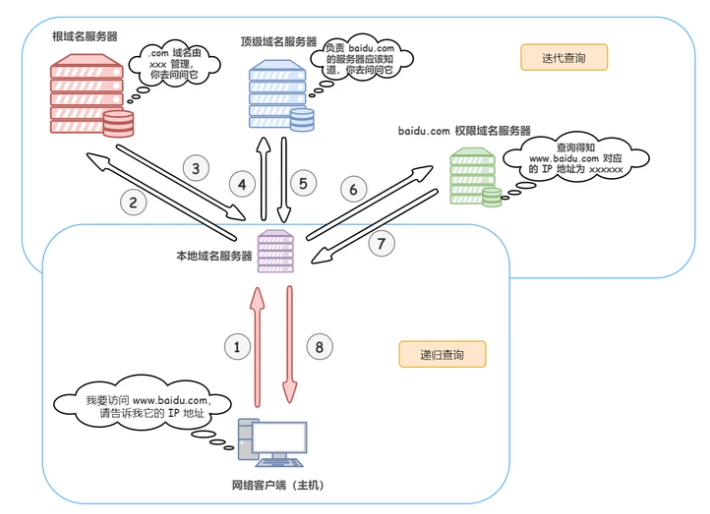

# 网络技术要点

## http和https

HTTP是传文本传输协议，是实现网络通信的一种规范。
HTTP常用于在Web浏览器和网站服务器之间传递信息，以明文方式发送内容，不提供任何方式的数据加密。
特点如下：

- 支持客户端/服务器模式
- 简单快速
  客户端向服务器请求服务时，只需传送请求方法和路径。由于http协议简单，使得HTTP服务器的程序规模小，因而通信速度很快。
- 灵活
  HTTP允许传输任意类型的数据对象。正在传输的又Content-Type标记。
- 无连接
  每次连接只处理一次请求。服务器处理完客户请求，并收到客户的应答后，即断开连接。采用这种方式可以节约传输时间。
- 无状态
  每个请求都是独立的，服务器不会记录之前的请求，所以对于每次请求都会返回相同的结果。
  HTTPS
  HTTP是以明文的方式进行传送，这样是并不安全的。而HTTPS出现正是为了解决HTTP不安全的特性。
  多的这一层是SSL/TCL协议，通过SSL证书来验证服务器的身份，并为浏览器和服务器之间的通信进行加密。
  SSL协议位于TCP/IP

## https的加密流程

HTTPS（HTTP Secure）是在HTTP协议基础上添加了安全性功能的协议，使用加密来保护数据的传输。以下是HTTPS的加密流程：

- 客户端发起连接请求：客户端（例如浏览器）向服务器发送一个连接请求，指示其希望建立一个安全的HTTPS连接。
- 服务器发送证书：服务器收到客户端的请求后，会将自己的数字证书发送给客户端。数字证书包含了服务器的公钥、证书有效期、证书颁发机构等信息。
- 客户端验证证书：客户端接收到服务器的证书后，会验证证书的有效性。这包括检查证书的签名是否有效、证书是否过期、证书颁发机构是否受信任等。
- 客户端生成随机密钥：如果证书验证成功，客户端会生成一个随机的对称密钥（即会话密钥），用于后续的对称加密。
- 使用服务器的公钥加密会话密钥：客户端使用服务器的公钥对生成的会话密钥进行加密，并将加密后的会话密钥发送给服务器。
- 服务器使用私钥解密会话密钥：服务器收到客户端发送的加密会话密钥后，使用自己的私钥进行解密，得到会话密钥。
- 加密通信：客户端和服务器现在都拥有相同的会话密钥。双方使用该会话密钥进行对称加密，加密和解密传输的数据。
  通过这个过程，HTTPS实现了安全的通信。客户端和服务器之间的数据传输是经过加密的，确保了数据的机密性和完整性，同时防止了中间人攻击和窃听。

## 如何理解OSI七层模型?

每一层实现各自的功能和协议，并完成与相邻的接口通信。

- 应用层
  DNS,HTTP，HTTPS
- 表示层
- 会话层
- 传输层
  传输层的主要任务是为了两台主进程之间的通信提供服务，处理数据包错误、数据包次序，以及其它一些关键传输的问题。
  TCP和UDP
- 网络层
- 数据链路层
- 物理层

## 三次握手和四次挥手

TCP（传输控制协议）是一种面向连接的、可靠的传输层协议。在建立连接和断开连接时，TCP 使用**三次握手**和**四次挥手**的机制来确保数据的可靠传输。以下是它们的简要说明：

---

### **TCP 三次握手（建立连接）**

三次握手用于在客户端和服务器之间建立 TCP 连接。目的是确保双方都能发送和接收数据。

1. **第一次握手（SYN）**：

   - 客户端向服务器发送一个 `SYN`（同步）报文，其中包含一个随机生成的初始序列号（`seq = x`）。
   - 客户端进入 `SYN_SENT` 状态。
2. **第二次握手（SYN + ACK）**：

   - 服务器收到 `SYN` 报文后，向客户端发送一个 `SYN + ACK`（同步 + 确认）报文。
     - `ACK` 报文的确认号为 `x + 1`（表示期望收到客户端的下一个序列号）。
     - 服务器也会生成一个随机序列号 `seq = y`。
   - 服务器进入 `SYN_RECEIVED` 状态。
3. **第三次握手（ACK）**：

   - 客户端收到 `SYN + ACK` 报文后，向服务器发送一个 `ACK`（确认）报文，确认号为 `y + 1`。
   - 客户端和服务器都进入 `ESTABLISHED` 状态，连接建立成功。

**总结**：

- 三次握手的目的是确保双方都能发送和接收数据。
- 通过交换初始序列号，双方可以确保数据的有序性和完整性。

---

### **TCP 四次挥手（断开连接）**

四次挥手用于在客户端和服务器之间断开 TCP 连接。目的是确保双方都能安全地关闭连接。

1. **第一次挥手（FIN）**：

   - 客户端向服务器发送一个 `FIN`（结束）报文，表示客户端没有数据要发送了。
   - 客户端进入 `FIN_WAIT_1` 状态。
2. **第二次挥手（ACK）**：

   - 服务器收到 `FIN` 报文后，向客户端发送一个 `ACK` 报文，确认收到 `FIN`。
   - 服务器进入 `CLOSE_WAIT` 状态，客户端进入 `FIN_WAIT_2` 状态。
   - 此时，服务器可能还有未发送完的数据。
3. **第三次挥手（FIN）**：

   - 当服务器完成数据发送后，向客户端发送一个 `FIN` 报文，表示服务器也没有数据要发送了。
   - 服务器进入 `LAST_ACK` 状态。
4. **第四次挥手（ACK）**：

   - 客户端收到 `FIN` 报文后，向服务器发送一个 `ACK` 报文，确认收到 `FIN`。
   - 客户端进入 `TIME_WAIT` 状态，等待一段时间（2MSL，Maximum Segment Lifetime）以确保服务器收到 `ACK`。
   - 服务器收到 `ACK` 后，关闭连接，进入 `CLOSED` 状态。
   - 客户端在 `TIME_WAIT` 结束后，也关闭连接，进入 `CLOSED` 状态。

**总结**：

- 四次挥手的目的是确保双方都能安全地关闭连接。
- 通过 `FIN` 和 `ACK` 的交换，确保双方都完成了数据的发送和接收。

---

### **为什么需要三次握手和四次挥手？**

1. **三次握手**：

   - 确保双方都能发送和接收数据。
   - 防止已失效的连接请求报文突然传送到服务器，导致错误。
2. **四次挥手**：

   - 确保双方都能安全地关闭连接。
   - 服务器可能需要时间处理未发送完的数据，因此需要分两次发送 `ACK` 和 `FIN`。

---

### **示意图**

#### 三次握手（建立连接）

<svg xmlns="http://www.w3.org/2000/svg" viewBox="0 0 640 380" style="max-width:640px;width:100%;height:auto;background:#fff;border:1px solid #e5e7eb;border-radius:8px;">
  <defs>
    <marker id="arr1" viewBox="0 0 10 10" refX="9" refY="5" markerWidth="8" markerHeight="8" orient="auto-start-reverse">
      <path d="M0,0 L10,5 L0,10 z" fill="#475569"/>
    </marker>
  </defs>
  <!-- 顶部角色 -->
  <rect x="60" y="20" width="120" height="34" rx="6" fill="#3b82f6"/>
  <text x="120" y="42" text-anchor="middle" fill="#fff" font-size="15" font-weight="700">客户端 Client</text>
  <rect x="460" y="20" width="120" height="34" rx="6" fill="#10b981"/>
  <text x="520" y="42" text-anchor="middle" fill="#fff" font-size="15" font-weight="700">服务器 Server</text>
  <!-- 时间线 -->
  <line x1="120" y1="60" x2="120" y2="360" stroke="#94a3b8" stroke-width="2" stroke-dasharray="4 4"/>
  <line x1="520" y1="60" x2="520" y2="360" stroke="#94a3b8" stroke-width="2" stroke-dasharray="4 4"/>
  <!-- 初始状态 -->
  <text x="120" y="78" text-anchor="middle" fill="#64748b" font-size="13" font-weight="600">CLOSED</text>
  <text x="520" y="78" text-anchor="middle" fill="#64748b" font-size="13" font-weight="600">LISTEN</text>
  <!-- ① SYN -->
  <text x="80" y="118" text-anchor="end" fill="#0ea5e9" font-size="13" font-weight="600">SYN_SENT</text>
  <line x1="120" y1="130" x2="520" y2="170" stroke="#475569" stroke-width="2" marker-end="url(#arr1)"/>
  <text x="320" y="142" text-anchor="middle" fill="#0f172a" font-size="13" font-weight="600">① SYN=1, seq=x</text>
  <!-- ② SYN+ACK -->
  <text x="560" y="188" text-anchor="start" fill="#16a34a" font-size="13" font-weight="600">SYN_RCVD</text>
  <line x1="520" y1="200" x2="120" y2="240" stroke="#475569" stroke-width="2" marker-end="url(#arr1)"/>
  <text x="320" y="212" text-anchor="middle" fill="#0f172a" font-size="13" font-weight="600">② SYN=1, ACK=1, seq=y, ack=x+1</text>
  <!-- ③ ACK -->
  <text x="80" y="258" text-anchor="end" fill="#0ea5e9" font-size="13" font-weight="600">ESTABLISHED</text>
  <line x1="120" y1="270" x2="520" y2="310" stroke="#475569" stroke-width="2" marker-end="url(#arr1)"/>
  <text x="320" y="282" text-anchor="middle" fill="#0f172a" font-size="13" font-weight="600">③ ACK=1, seq=x+1, ack=y+1</text>
  <text x="560" y="328" text-anchor="start" fill="#16a34a" font-size="13" font-weight="600">ESTABLISHED</text>
  <!-- 底部数据传输 -->
  <line x1="120" y1="350" x2="520" y2="350" stroke="#f59e0b" stroke-width="2" marker-end="url(#arr1)" marker-start="url(#arr1)"/>
  <text x="320" y="345" text-anchor="middle" fill="#f59e0b" font-size="13" font-weight="700">🎉 连接建立，开始数据传输</text>
</svg>

| 步骤 | 方向 | 报文 | 客户端状态 | 服务器状态 |
|------|------|------|----------|----------|
| ① | C → S | `SYN` (seq=x) | `SYN_SENT` | `LISTEN` |
| ② | S → C | `SYN+ACK` (seq=y, ack=x+1) | `SYN_SENT` | `SYN_RCVD` |
| ③ | C → S | `ACK` (seq=x+1, ack=y+1) | `ESTABLISHED` | `ESTABLISHED` |

> 💡 **记忆口诀**：「我能发 → 你能收能发 → 我能收」，三次刚好让双方都确认对方的收发能力。

---

#### 四次挥手（断开连接）

<svg xmlns="http://www.w3.org/2000/svg" viewBox="0 0 640 480" style="max-width:640px;width:100%;height:auto;background:#fff;border:1px solid #e5e7eb;border-radius:8px;">
  <defs>
    <marker id="arr2" viewBox="0 0 10 10" refX="9" refY="5" markerWidth="8" markerHeight="8" orient="auto-start-reverse">
      <path d="M0,0 L10,5 L0,10 z" fill="#475569"/>
    </marker>
  </defs>
  <!-- 顶部角色 -->
  <rect x="60" y="20" width="120" height="34" rx="6" fill="#3b82f6"/>
  <text x="120" y="42" text-anchor="middle" fill="#fff" font-size="15" font-weight="700">客户端 Client</text>
  <rect x="460" y="20" width="120" height="34" rx="6" fill="#10b981"/>
  <text x="520" y="42" text-anchor="middle" fill="#fff" font-size="15" font-weight="700">服务器 Server</text>
  <!-- 时间线 -->
  <line x1="120" y1="60" x2="120" y2="460" stroke="#94a3b8" stroke-width="2" stroke-dasharray="4 4"/>
  <line x1="520" y1="60" x2="520" y2="460" stroke="#94a3b8" stroke-width="2" stroke-dasharray="4 4"/>
  <!-- 初始状态 -->
  <text x="120" y="78" text-anchor="middle" fill="#64748b" font-size="13" font-weight="600">ESTABLISHED</text>
  <text x="520" y="78" text-anchor="middle" fill="#64748b" font-size="13" font-weight="600">ESTABLISHED</text>
  <!-- ① FIN -->
  <text x="80" y="118" text-anchor="end" fill="#0ea5e9" font-size="13" font-weight="600">FIN_WAIT_1</text>
  <line x1="120" y1="130" x2="520" y2="165" stroke="#475569" stroke-width="2" marker-end="url(#arr2)"/>
  <text x="320" y="142" text-anchor="middle" fill="#0f172a" font-size="13" font-weight="600">① FIN=1, seq=u</text>
  <!-- ② ACK -->
  <text x="560" y="183" text-anchor="start" fill="#16a34a" font-size="13" font-weight="600">CLOSE_WAIT</text>
  <line x1="520" y1="195" x2="120" y2="230" stroke="#475569" stroke-width="2" marker-end="url(#arr2)"/>
  <text x="320" y="207" text-anchor="middle" fill="#0f172a" font-size="13" font-weight="600">② ACK=1, ack=u+1</text>
  <text x="80" y="248" text-anchor="end" fill="#0ea5e9" font-size="13" font-weight="600">FIN_WAIT_2</text>
  <!-- 半关闭说明 -->
  <rect x="430" y="218" width="180" height="50" rx="6" fill="#fef3c7" stroke="#f59e0b"/>
  <text x="520" y="238" text-anchor="middle" fill="#92400e" font-size="11" font-weight="600">服务器处理剩余数据</text>
  <text x="520" y="255" text-anchor="middle" fill="#92400e" font-size="11">（半关闭，仍可发送）</text>
  <!-- ③ FIN -->
  <text x="560" y="298" text-anchor="start" fill="#16a34a" font-size="13" font-weight="600">LAST_ACK</text>
  <line x1="520" y1="310" x2="120" y2="345" stroke="#475569" stroke-width="2" marker-end="url(#arr2)"/>
  <text x="320" y="322" text-anchor="middle" fill="#0f172a" font-size="13" font-weight="600">③ FIN=1, ACK=1, seq=v, ack=u+1</text>
  <!-- ④ ACK -->
  <text x="80" y="363" text-anchor="end" fill="#dc2626" font-size="13" font-weight="600">TIME_WAIT</text>
  <line x1="120" y1="375" x2="520" y2="410" stroke="#475569" stroke-width="2" marker-end="url(#arr2)"/>
  <text x="320" y="387" text-anchor="middle" fill="#0f172a" font-size="13" font-weight="600">④ ACK=1, seq=u+1, ack=v+1</text>
  <text x="560" y="428" text-anchor="start" fill="#64748b" font-size="13" font-weight="600">CLOSED</text>
  <!-- TIME_WAIT 说明 -->
  <text x="80" y="408" text-anchor="end" fill="#dc2626" font-size="11" font-style="italic">等待 2MSL</text>
  <text x="80" y="450" text-anchor="end" fill="#64748b" font-size="13" font-weight="600">CLOSED</text>
</svg>

| 步骤 | 方向 | 报文 | 客户端状态 | 服务器状态 |
|------|------|------|----------|----------|
| ① | C → S | `FIN` | `FIN_WAIT_1` | `ESTABLISHED` |
| ② | S → C | `ACK` | `FIN_WAIT_2` | `CLOSE_WAIT` |
| ③ | S → C | `FIN` | `FIN_WAIT_2` | `LAST_ACK` |
| ④ | C → S | `ACK` | `TIME_WAIT` → `CLOSED` | `CLOSED` |

> ⚠️ **为什么是 4 次而不是 3 次？**
> 服务器收到 `FIN` 后，可能还有数据未发完，所以 `ACK` 和 `FIN` 必须**分两次发送**（不能像握手那样合并）。这就是 TCP 的「半关闭」特性。

> ⏱️ **为什么 TIME_WAIT 要等 2MSL？**
> - 确保最后一个 `ACK` 能可靠到达服务器（若丢失，服务器会重传 `FIN`）
> - 让旧连接的残留报文在网络中自然消亡，避免污染新连接

---

## TCP协议和UDP协议的区别

- 他们都位于osi七层模型的传输层
- 主要区别

1. 可靠性：tcp是一种可靠的协议，它提供了数据之间的可靠传输和错误检验机制。它可以确认、重传和流控制等机制来确保数据的完整性和数序性。udp是一种不可靠的协议，它不提供数据的可靠性传输保证，每个数据报都是独立的实体，可能丢失、重复或者乱序。
2. 连接性：tcp是一种面向连接的协议，他在通信之前需要通过三次握手来确保通信双方之间的连接建立。udp是一种面向无连接的协议，它不需要建立连接，发送方可以直接将数据报发送到目标地址
3. 传输效率：因为tcp提供了可靠性和复杂的控制机制，所以它的传输效率相对较低。而udp是一种轻量级的协议，没复杂的控制机制，所以传输效率相对较快
4. tcp是面向字节流的，将应用层的报文看成一串串的无结构的字节流，分解到多个tcp报文中传输后，在目标站重新装配。udp协议面向报文，不拆分报文，只保留边界，一个个发送报文，接收方去除报文首部后，原封不动的把报文交给上层。
5. tcp应用于对数据完整性和可靠性要求高的应用场景，如网页浏览，文件传输，电子邮件等。udp适用于实时性要求高的、对数据可靠性要求较低的场景，如音视频播放、实时游戏、流媒体等。

## WebSocket 专题

> 📂 WebSocket 相关面试题（理解、心跳、重连、SSE 对比、二进制传输、连接数扩展、与 WebRTC 对比等）已抽离至独立文档：[WebSocket 专题](./WebSocket.md)

---

## 说说地址栏输入 URL 敲下回车后发生了什么?

- URL解析：首先判断你输入的是一个合法的URL 还是一个待搜索的关键词，并且根据你输入的内容进行对应操作
- DNS 查询：见下文
- TCP 连接：基于url解析出来的协议来和服务器建立连接
- HTTP 请求：一旦与服务器建立连接，浏览器会发送一个HTTP请求，其中包含请求的方法（GET、POST等）、目标URL、请求头部和请求体等信息
- 处理请求：服务器接收到浏览器发送的HTTP请求后，会根据请求中的信息进行处理。它会解析URL、读取请求头部和请求体，并执行相应的逻辑来生成响应
- 响应请求：服务器根据请求的处理结果生成一个HTTP响应，包括响应状态码、响应头部和响应体等信息。响应的内容可能是HTML页面、图像、文本文件或其他数据
- 接受请求：浏览器接收到服务器发送的HTTP响应后，会读取响应头部和响应体等信息
- 页面渲染：如果响应是一个HTML页面，浏览器会解析HTML代码，并根据其中的CSS和JavaScript等资源进行页面的渲染和布局

## DNS解析过程

什么是dns：域名系统，是互联网一项服务，是进行域名和与之相对应的 IP 地址进行转换的服务器。简单来讲，DNS相当于一个翻译官，负责将域名翻译成ip地址
IP 地址：一长串能够唯一地标记网络上的计算机的数字
域名：是由一串用点分隔的名字组成的 Internet 上某一台计算机或计算机组的名称，用于在数据传输时对网站的定位标识
解析域名的过程如下：

- 首先搜索浏览器的 DNS 缓存，缓存中维护一张域名与 IP 地址的对应表
- 若没有命中，则继续搜索操作系统的 DNS 缓存
- 若仍然没有命中，则操作系统将域名发送至本地域名服务器，本地域名服务器采用递归查询自己的 DNS 缓存，查找成功则返回结果
- 若本地域名服务器的 DNS 缓存没有命中，则本地域名服务器向上级域名服务器进行迭代查询
  - 首先本地域名服务器向根域名服务器发起请求，根域名服务器返回顶级域名服务器的地址给本地服务器
  - 本地域名服务器拿到这个顶级域名服务器的地址后，就向其发起请求，获取权限域名服务器的地址
  - 本地域名服务器根据权限域名服务器的地址向其发起请求，最终得到该域名对应的 IP 地址
- 本地域名服务器将得到的 IP 地址返回给操作系统，同时自己将 IP 地址缓存起来
- 操作系统将 IP 地址返回给浏览器，同时自己也将 IP 地址缓存起
- 至此，浏览器就得到了域名对应的 IP 地址，并将 IP 地址缓存起
  

## http发送请求和dns发送一个请求的区别以及哪个更快

HTTP（Hypertext Transfer Protocol）和DNS（Domain Name System）是在互联网通信中扮演不同角色的两个协议，它们的作用和性质有所不同。下面是它们在发送请求方面的区别：

- TTP请求：HTTP是用于在客户端和服务器之间传输超文本数据的协议。当客户端需要获取某个资源（如网页、图片、视频等）时，会通过HTTP协议发送一个HTTP请求给服务器，请求的内容包括请求方式（如GET、POST）、请求路径、请求头和请求体等。服务器接收到请求后，根据请求的路径和其他信息，处理请求并返回相应的资源。
- DNS请求：DNS是用于将域名解析为对应IP地址的协议。当客户端需要访问某个域名的网站时，它需要先将域名转换为IP地址，以便建立与服务器的连接。客户端会发送一个DNS查询请求给DNS服务器，请求的内容包括要解析的域名。DNS服务器接收到请求后，会递归地查询和解析域名，并返回对应的IP地址给客户端。
  在请求的速度方面，DNS请求通常比HTTP请求快速。这是因为DNS请求通常只涉及域名解析的过程，而该过程通常是在本地操作系统或本地DNS缓存中完成的，而不需要通过网络发送到远程服务器。因此，DNS解析的速度主要取决于本地缓存和网络环境的响应速度。

---

相比之下，HTTP请求涉及到与服务器的通信，需要经过网络传输数据。HTTP请求的速度受到多个因素的影响，包括网络延迟、服务器响应时间、带宽限制等。因此，HTTP请求的速度通常比DNS请求慢一些。

需要注意的是，HTTP和DNS是在不同的层面上进行通信的协议，它们的目的和功能不同。HTTP用于传输数据，实现客户端和服务器之间的通信；而DNS用于域名解析，将域名映射为IP地址。它们在互联网通信中发挥着各自重要的作用，无法直接比较哪个更快，因为它们的性质和功能不同。

## 常见的HTTP请求头

- accept 浏览器可接受的MIME类型，如application/json、text/plain等
- Cookie
- Host
  初始URL中的主机和端口

## `<span style="color: red; font-weight: 700;">`HTTP缓存（强缓存、协商缓存）

HTTP 缓存分为**强缓存**和**协商缓存**两种机制，它们共同作用以减少不必要的网络请求，提升性能。以下是它们的详细说明：

---

**1. 强缓存**
强缓存是指客户端直接从本地缓存中获取资源，而不向服务器发送请求。强缓存通过响应头中的 `Cache-Control` 和 `Expires` 字段来控制。

**实现强缓存的响应头字段**

- **`Cache-Control`**：

  - `max-age=<seconds>`：资源在缓存中的最大存活时间（相对于请求时间）。
  - `no-cache`：不使用强缓存，每次请求都需验证资源是否更新。
  - `no-store`：禁止缓存资源。
  - `public`：资源可以被任何缓存（如浏览器、代理服务器）缓存。
  - `private`：资源只能被客户端缓存，不能被代理服务器缓存。

  示例：

  ```http
  Cache-Control: max-age=3600, public
  ```
- **`Expires`**：

  - 指定资源的过期时间（绝对时间），是一个 HTTP/1.0 的字段。
  - 示例：
    ```http
    Expires: Wed, 21 Oct 2023 07:28:00 GMT
    ```

**强缓存的工作流程**

1. 客户端首次请求资源，服务器返回资源并设置 `Cache-Control` 或 `Expires`。
2. 客户端再次请求时，先检查缓存是否过期：
   - 如果未过期（`max-age` 或 `Expires` 有效），直接从缓存中读取资源，**不会向服务器发送请求**。
   - 如果已过期，则进入协商缓存流程。

**强缓存的命中与未命中**

- **命中**：状态码为 `200 (from disk cache)` 或 `200 (from memory cache)`。
- **未命中**：缓存失效，进入协商缓存。

---

**2. 协商缓存**
协商缓存是指客户端向服务器发送请求，验证本地缓存是否仍然有效。如果有效，服务器返回 `304 Not Modified`，客户端使用本地缓存；如果无效，服务器返回新的资源。

**实现协商缓存的响应头字段**

- **`Last-Modified` 和 `If-Modified-Since`**：

  - `Last-Modified`：服务器返回资源时，携带资源的最后修改时间。
  - `If-Modified-Since`：客户端再次请求时，将该时间发送给服务器，服务器判断资源是否修改。
  - 示例：
    ```http
    Last-Modified: Wed, 21 Oct 2023 07:28:00 GMT
    If-Modified-Since: Wed, 21 Oct 2023 07:28:00 GMT
    ```
- **`ETag` 和 `If-None-Match`**：

  - `ETag`：服务器返回资源时，携带资源的唯一标识（通常是哈希值）。
  - `If-None-Match`：客户端再次请求时，将该标识发送给服务器，服务器判断资源是否修改。
  - 示例：
    ```http
    ETag: "123456"
    If-None-Match: "123456"
    ```

**协商缓存的工作流程**

1. 客户端首次请求资源，服务器返回资源并设置 `Last-Modified` 或 `ETag`。
2. 客户端再次请求时，携带 `If-Modified-Since` 或 `If-None-Match`。
3. 服务器验证资源是否修改：
   - 如果未修改，返回 `304 Not Modified`，客户端使用本地缓存。
   - 如果已修改，返回新的资源（状态码 `200`）。

**协商缓存的命中与未命中**

- **命中**：状态码为 `304 Not Modified`。
- **未命中**：状态码为 `200`，返回新的资源。

---

**3. 强缓存与协商缓存的区别**

| **特性**         | **强缓存**                                         | **协商缓存**                       |
| ---------------------- | -------------------------------------------------------- | ---------------------------------------- |
| **是否发送请求** | 否，直接从缓存读取                                       | 是，向服务器验证缓存是否有效             |
| **状态码**       | `200 (from disk cache)` 或 `200 (from memory cache)` | `304 Not Modified`                     |
| **响应头字段**   | `Cache-Control`、`Expires`                           | `Last-Modified`、`ETag`              |
| **请求头字段**   | 无                                                       | `If-Modified-Since`、`If-None-Match` |
| **优先级**       | 优先使用强缓存，失效后使用协商缓存                       | 强缓存失效后触发                         |

---

**4. 实际应用中的缓存策略**

1. **静态资源（如 CSS、JS、图片）**：

   - 使用强缓存，设置较长的 `max-age`（如一年）。
   - 通过文件名哈希（如 `app.12345.js`）确保资源更新后客户端能获取最新版本。
2. **动态资源（如 API 数据）**：

   - 使用协商缓存，设置 `Cache-Control: no-cache` 或 `max-age=0`。
   - 通过 `ETag` 或 `Last-Modified` 验证资源是否更新。

---

**5. 示例**
**强缓存示例**

```http
HTTP/1.1 200 OK
Cache-Control: max-age=3600, public
Expires: Wed, 21 Oct 2023 08:28:00 GMT
```

**协商缓存示例**

```http
HTTP/1.1 200 OK
Last-Modified: Wed, 21 Oct 2023 07:28:00 GMT
ETag: "123456"
```

**协商缓存验证（未修改）**

```http
GET /resource HTTP/1.1
If-Modified-Since: Wed, 21 Oct 2023 07:28:00 GMT
If-None-Match: "123456"

HTTP/1.1 304 Not Modified
```

---

**总结**

- **强缓存**：直接从本地缓存读取资源，不发送请求。
- **协商缓存**：向服务器验证缓存是否有效，返回 `304` 或新资源。
- 实际开发中，通常结合两者使用：优先强缓存，失效后使用协商缓存。

## Q: 如何设计一个支持超时取消和重试的 fetch 封装？

**A:**

原生 `fetch` 没有内置超时机制，需要通过 `AbortController` 实现。

**基础版：单次 fetch + 超时控制**

```js
function fetchWithTimeout(url, options = {}, timeout = 10000) {
  const controller = new AbortController()
  const timeoutId = setTimeout(() => controller.abort(), timeout)

  return fetch(url, { ...options, signal: controller.signal })
    .then(res => {
      clearTimeout(timeoutId)
      if (!res.ok) throw new Error(`HTTP ${res.status}`)
      return res.json()
    })
    .catch(err => {
      clearTimeout(timeoutId)
      if (err.name === 'AbortError') {
        throw new Error(`请求超时（${timeout}ms）`)
      }
      throw err
    })
}
```

**进阶版：支持超时 + 自动重试 + 指数退避**

```js
async function fetchWithRetry(url, options = {}, {
  timeout = 10000,
  retries = 3,
  retryDelay = 1000,   // 初始重试间隔
  retryOn = [503, 429] // 哪些状态码触发重试
} = {}) {

  for (let attempt = 0; attempt <= retries; attempt++) {
    const controller = new AbortController()
    const timeoutId = setTimeout(() => controller.abort(), timeout)

    try {
      const res = await fetch(url, { ...options, signal: controller.signal })
      clearTimeout(timeoutId)

      // 判断是否需要重试
      if (retryOn.includes(res.status) && attempt < retries) {
        const delay = retryDelay * Math.pow(2, attempt) // 指数退避
        await sleep(delay)
        continue
      }

      if (!res.ok) throw new Error(`HTTP ${res.status}`)
      return await res.json()

    } catch (err) {
      clearTimeout(timeoutId)

      const isLast = attempt === retries
      if (isLast) throw err  // 最后一次失败，直接抛出

      if (err.name === 'AbortError') {
        // 超时也重试
        await sleep(retryDelay * Math.pow(2, attempt))
      } else {
        throw err  // 非超时错误，不重试
      }
    }
  }
}

function sleep(ms) { return new Promise(r => setTimeout(r, ms)) }
```

**所谓"不会超时"的方案 —— 断点重连 + 无限重试：**

```js
async function fetchUntilSuccess(url, options = {}) {
  let delay = 1000
  while (true) {
    try {
      const res = await fetchWithTimeout(url, options, 15000)
      return res
    } catch (err) {
      console.warn(`请求失败，${delay}ms 后重试：`, err.message)
      await sleep(delay)
      delay = Math.min(delay * 2, 30000) // 最大等 30s 重试一次
    }
  }
}
```

> ⚠️ **注意**：真正的"不会超时"设计应结合业务场景，无限重试可能造成接口雪崩。生产环境建议加**最大重试次数限制**和**断路器（Circuit Breaker）机制**。

---

## Q: WebRTC 的核心原理是什么？完整建连流程是怎样的？

**A:**

**WebRTC** 是浏览器端实时音视频/数据通信标准，核心目标是在端到端（P2P）场景下实现低延迟通信。

核心组成：

1. **媒体采集**：`getUserMedia` 获取摄像头/麦克风流。
2. **连接对象**：`RTCPeerConnection` 负责音视频与 DataChannel 传输。
3. **信令通道**：交换 SDP/ICE 信息（通常用 WebSocket 实现，WebRTC 本身不规定信令协议）。
4. **NAT 穿透**：通过 STUN 获取公网映射地址，必要时通过 TURN 中继转发。

标准建连流程：

1. A 端创建 `offer`（SDP），通过信令发送给 B。
2. B 端设置远端描述并创建 `answer`，再回传给 A。
3. 双方持续交换 ICE Candidate（候选网络路径）。
4. ICE 选出最优链路后，媒体流与数据通道建立。
5. 若直连失败，自动回退到 TURN 中继。

```ts
// 简化示意：A 端创建 offer
const pc = new RTCPeerConnection({
  iceServers: [{ urls: 'stun:stun.l.google.com:19302' }]
})

const stream = await navigator.mediaDevices.getUserMedia({ audio: true, video: true })
stream.getTracks().forEach(track => pc.addTrack(track, stream))

const offer = await pc.createOffer()
await pc.setLocalDescription(offer)
// 通过信令服务器把 offer 发给对端
```

| 对比维度 | WebSocket | WebRTC |
|------|------|------|
| 连接形态 | 客户端-服务器 | 端到端（优先 P2P） |
| 典型场景 | 即时消息、推送 | 音视频通话、实时互动、点对点数据传输 |
| 延迟表现 | 取决于服务端链路 | 直连时通常更低 |
| 是否需要信令 | 不需要（自身即通信通道） | ✅ 需要（交换 SDP/ICE） |

> ⚠️ **注意**：WebRTC 并不“去服务器化”，生产环境至少需要信令服务；复杂网络下还通常需要 TURN 服务保障连通率。

---
