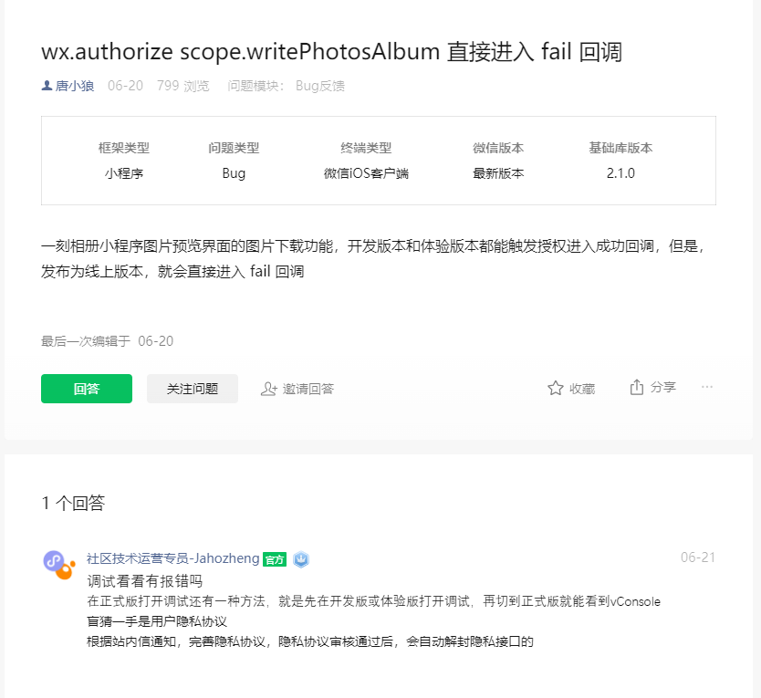

#  有关API
- wx.getSetting(Object object)
    > 获取用户的当前设置。返回值中只会出现小程序已经向用户请求过的权限
- wx.authorize(Object object)
    > 提前向用户发起授权请求。调用后会立刻弹窗询问用户是否同意授权小程序使用某项功能或获取用户的某些数据，但不会实际调用对应接口。如果用户之前已经同意授权，则不会出现弹窗，直接返回成功
# 方案
例子：获取权限方案，上传图片
```javascript
    wx.getSetting({
        success(res) {
          if (!res.authSetting['scope.writePhotosAlbum']) {
            wx.authorize({
              scope: 'scope.writePhotosAlbum',
              success () {
                // 成功回调
              },
              fail () {
                wx.showToast({
                  title: '检测手机未开启保存相册的权限，请开启后重试',
                  icon: 'none',
                  duration: 2000,
                })
              }
            })
          } else {
            // 已经获取权限的处理
          }
        }
      })
```
## 遇到的坑



直接用上述的方法，在开发版本和体验版本都是可以直接用的。但是真正发布之后会有一直执行fail回调，需要提交审核完善用户权限才可以❗
是需要微信那边进行审核的。


## 小程序用户隐私保护指引

这个地方看官方文档的解释就好
['官方文档'](https://developers.weixin.qq.com/miniprogram/dev/framework/user-privacy/)