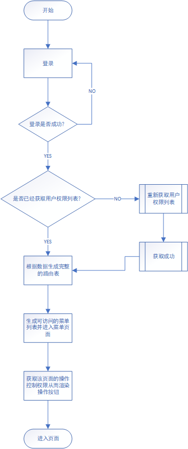

## 权限管理

## 路由权限方案

### route > meta > permission

可以在路由中设置

```javascript
const routes = [
  {
    path: '/admin',
    component: AdminComponent,
    meta: {
      permission: 'admin',
    },
  },
  {
    path: '/user',
    component: UserComponent,
    meta: {
      permission: 'user',
    },
  },
];
```

可以路由守卫中进行统一权限验证

```javascript
router.beforeEach((to, from, next) => {
  const requiredPermission = to.meta.permission; // 获取路由配置中的权限要求
  if (requiredPermission) { // 如果当前路由配置了权限要求
    if (hasPermission(currentUserPermissions, requiredPermission)) {
      // 用户具有所需权限
      next();
    } else {
      // 用户没有所需权限，可以进行重定向或其他操作
      next('/login');
    }
  } else {
    // 路由没有配置权限要求，直接通过
    next();
  }
});
```

### 完整路线



## 按钮级别权限方案

### v-permission


## 登录注册权限方案

一般情况下

