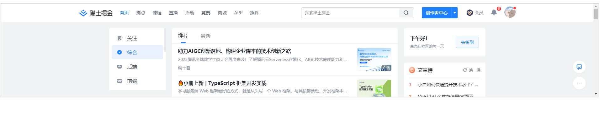
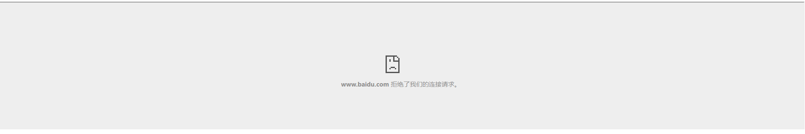

# 已发-李和贵
## 🌊什么是iframe

iframe 标签规定一个内联框架。内联框架就是在一个页面中嵌入另一个页面。

>由于 iframe 可能在某些方面不符合标准网页设计的理念，已经被HTMLl5抛弃，目前的HTML5不再支持它了
### 我们来看一个demo

./code/iframe1.html

```html
<!DOCTYPE html>
<html lang="en">
<head>
  <meta charset="UTF-8">
  <meta http-equiv="X-UA-Compatible" content="IE=edge">
  <meta name="viewport" content="width=device-width, initial-scale=1.0">
  <title>Document</title>
</head>
<body>
  <iframe src='https://www.juejin.cn' width="100%" height="300px"></iframe>
</body>
</html>

```


如果我们把链接换成www.baidu.com
./code/iframe2.html


### iframe的常用属性

- frameborder
- width
- height
- name
- src
- scrolling
- sandbox 安全限制`
  - alallow-scripts `允许运行脚本`
  - allow-downlods `允许下载`
  - allow-same-origin `允许同域请求:ajax`
  - allow-top-navigation `允许使用顶层上下文的导航: window.top`
  - allow-popups `允许从 iframe 中弹出新窗口:window.open`
  - allow-forms `允许 form 表单提交`
  
更加详细的属性解释，看下方的MDN链接
### iframe的优缺点

优点
- 使用起来很方便
- 方便开发，减少代码的重复率
缺点
- 部分使用会产生跨域
- 浏览器后退按钮无效

## 🌊点击劫持和安全策略

- CSP(Content Security Policy,即内容安全策略)
    >Content Security Policy (CSP) 是一种网络安全策略，用于减少和报告网站上的 XSS (跨站脚本)、数据注入和点击劫持等攻击。
CSP 通过定义合法的内容来源，限制浏览器加载和执行特定资源的方式。它基于白名单原则，只允许来自特定源的内容加载和执行，阻止任何不在白名单上的资源，从而防止恶意脚本的执行。
CSP 允许网站管理员制定一系列的策略指令，这些指令告诉浏览器可以执行哪些任务和从哪些地方加载资源。常见的 CSP 指令包括 default-src、script-src、style-src、img-src 等。
CSP 的优点是可以减少许多客户端的攻击，提高网站的安全性。然而，配置 CSP 需要考虑到网站的需求和资源来源，因此需要进行正确的配置和测试，以确保不影响网站的正常运行。

## 🌊postMessage通信

我们先来看一个例子（我们可以借助vscode的一个插件`Live Server`来启动服务）

project1

```html
<!DOCTYPE html>
<html lang="en">

<head>
    <meta charset="UTF-8">
    <meta name="viewport" content="width=device-width, initial-scale=1.0">
    <title>Document</title>
</head>

<body>
    <h1>项目一</h1>
    <iframe src="http://127.0.0.1:5500/docs/repository/temp_lihegui/pro2/index.html" frameborder="0" width="300px"
        height="300px"></iframe>
    <script>
        window.addEventListener('message', (event) => {
            console.log("监听到了");
            console.log('====================================');
            console.log(event.data);
            console.log('====================================');
        })
    </script>
</body>

</html>
```

project2

```html
<!DOCTYPE html>
<html lang="en">

<head>
    <meta charset="UTF-8">
    <meta name="viewport" content="width=device-width, initial-scale=1.0">
    <title>Document</title>
</head>

<body>
    <h1 onclick="publish()">项目二</h1>
    <script>
        function publish() {
            console.log('publish');
            window.parent.postMessage({
                messgae:'传输'
            }, '*')
        }
    </script>
</body>

</html>
```

**💣遇到的坑**

如果受同源协议限制，window.parent获取到数据都是空壳原始数据，但是这个方法还是可以用的

### postMessage
>window.postMessage() 方法允许来自一个文档的脚本可以传递文本消息到另一个文档里的脚本，而不用管是否跨域。一个文档里的脚本还是不能调用在其他文档里方法和读取属性，但他们可以用这种消息传递技术来实现安全的通信。

**参数说明**

- message：要发送的消息内容。它可以是任何 JavaScript 可序列化的对象或基本类型。
- targetOrigin：目标窗口的 URL。只有与目标窗口的 URL 完全匹配时，消息才会被发送。这是为了防止恶意代码发送消息到不受信任的窗口。
- transfer：一个可选的数组，包含需要传递到目标窗口的 Transferable 对象。Transferable 对象是一些特定类型的对象，如 ArrayBuffer 和 MessagePort，它们可以在窗口间转移所有权，而不是进行复制操作。这可以提高性能，尤其是对于大型数据。

**应用场景**

- 页面和其打开的新窗口的数据传递
- 页面与嵌套的 iframe 消息传递
- 多窗口之间消息传递

##  🌊iframe如何解决跨域

>在嵌入的网页和包含 iframe 的页面之间存在一个同源策略。即使 iframe 的协议与页面的协议相同，如果它们的域名、端口号或协议之一不匹配，那么 iframe 将被认为不是同源，访问其中的内容将受到限制。

大多数解决办法都是更改协议，这种当方式往往不现实，一般需求可以通过

- URL传递参数✔️
- postMessage来进行通信✔️

这两种方式还是可以的

跨域在这里就不多说了


## 资源链接
[一个容易被忽视的标签 —— iframe](https://juejin.cn/post/7172141725127819295?searchId=2023082814111593BDF8AAF15C07A79A7D)
[postMessage - 跨域消息传递](https://blog.csdn.net/huangpb123/article/details/83692019)
[MDN文档]https://developer.mozilla.org/en-US/docs/Web/HTML/Element/iframe